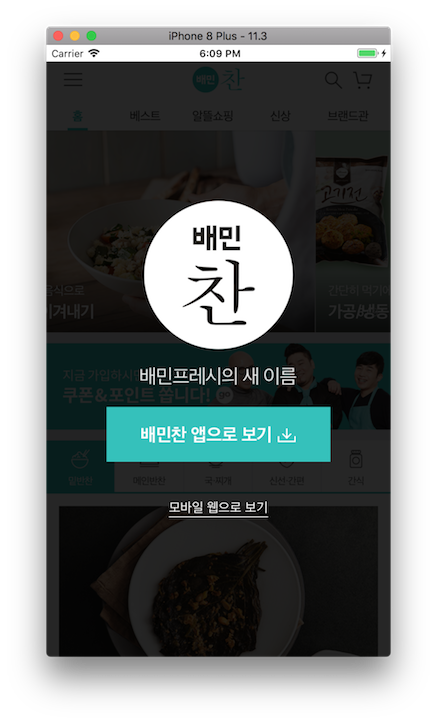
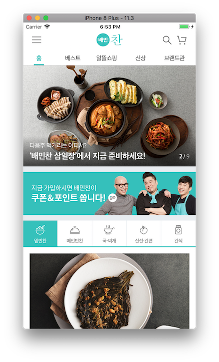
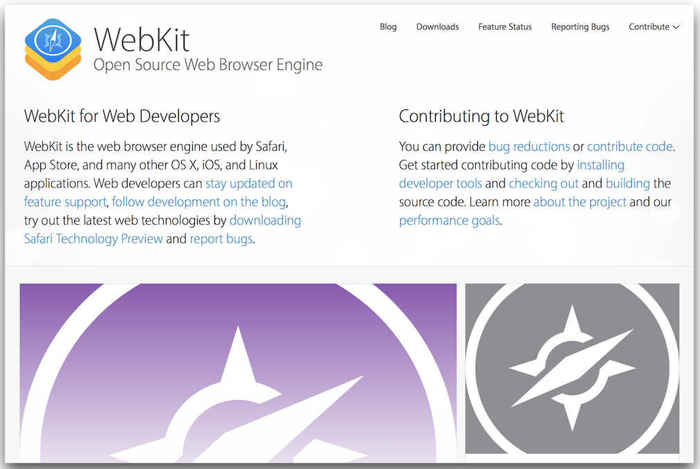
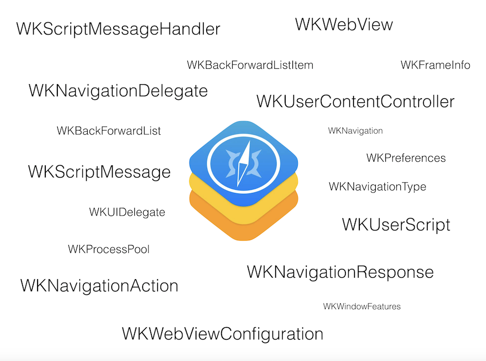
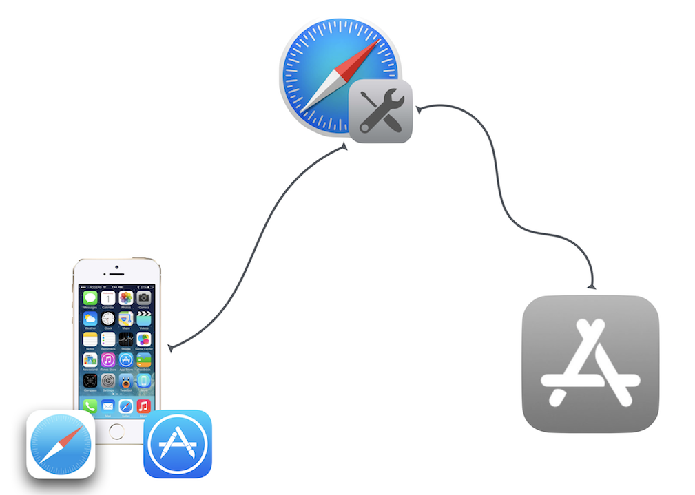
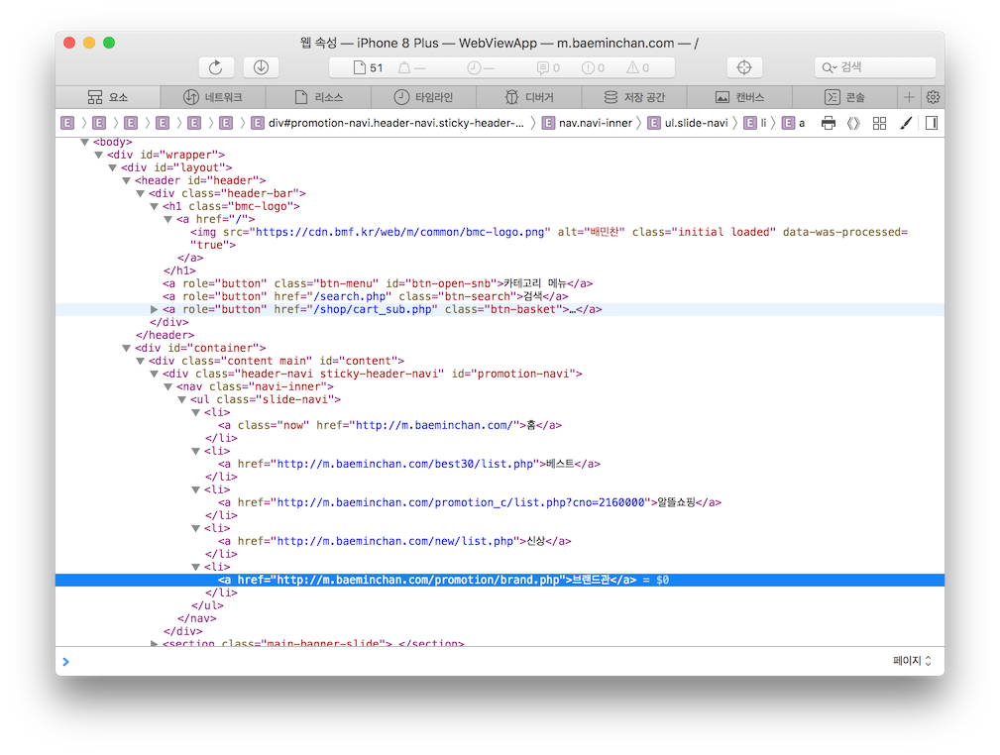
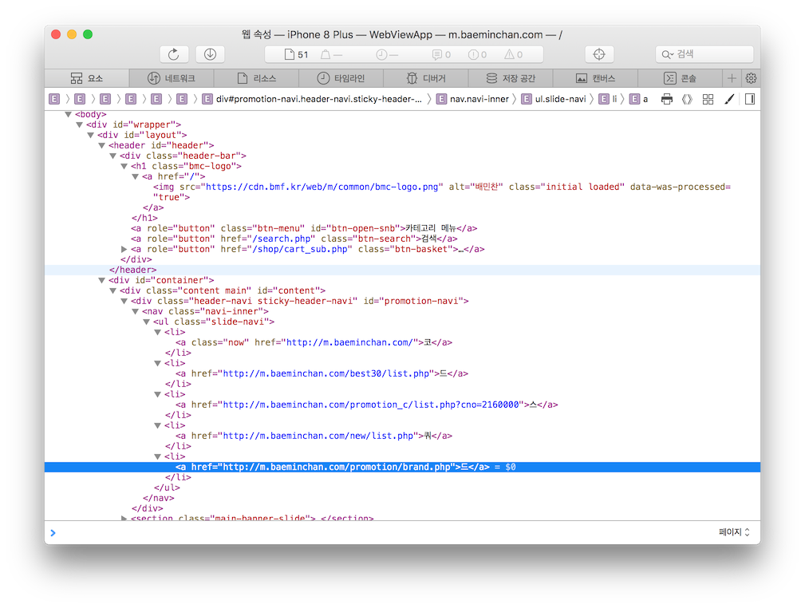
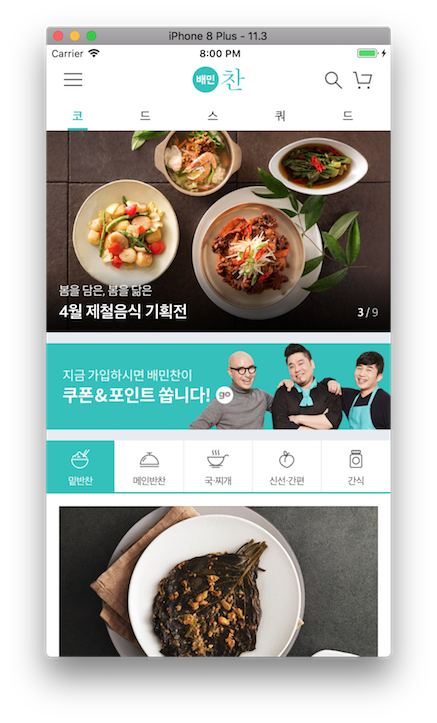

# 웹 기반 앱

## Step1 (시작하기 - 웹뷰)
### 요구사항
- iOS 프로젝트 Single View App 템플릿으로 하고 프로젝트 이름을 "WebviewApp"으로 지정하고, 위에 만든 로컬 저장소 경로에 생성한다.
- 웹뷰 WebView 기반으로 이미 만들어진 모바일 웹 사이트를 앱으로 만드는 것을 목표로 한다.
```
  A web view loads and displays rich web content, such as embedded HTML and websites, directly within your app. 
  Mail uses a web view, for example, to show HTML content in messages.
```
> 이미 웹뷰는 메일 앱 뿐만 아니라 HTML 콘텐츠를 표시하는 방법으로 많이 사용하고 있다.

- readme.md 파일을 자신의 프로젝트에 대한 설명으로 변경한다.
    - 단계별로 미션을 해결하고 리뷰를 받고나면 readme.md 파일에 주요 작업 내용(바뀐 화면 이미지, 핵심 기능 설명)과 완성 날짜시간을 기록한다.
    - 실행한 화면을 캡처해서 readme.md 파일에 포함한다.

### 프로그래밍 요구사항
- UIWebView를 ViewController 화면을 가득 채우도록 오토레이아웃을 설정한다.
- 웹뷰에 https://m.baeminchan.com 주소로 접속하도록 지정한다.
- UIWebViewDelegate 메소드들을 구현해놓고 print(#function)처럼 어느 시점에 메소드가 호출되는지 확인한다.
- 매개변수가 있는 메소드 경우에는 매개변수 값도 함께 출력한다.
- 메뉴 여기저기를 눌러서 앱 내부에서 잘 동작하는지 확인한다. 특히 PC버전 웹사이트나 외부 사이트로 이동하지 않도록 한다. 예) 장바구니 -> 회사소개 -> 인스타그램 또는 페이스북

### 결과
#### UI



---
## Step2 (WKWebView와 웹킷)
### 요구사항
- UIWebView 웹뷰 제약사항이 있어서 WKWebView 기반으로 개선하는 것을 목표로 한다.

- readme.md 파일을 자신의 프로젝트에 대한 설명으로 변경한다.
    - 단계별로 미션을 해결하고 리뷰를 받고나면 readme.md 파일에 주요 작업 내용(바뀐 화면 이미지, 핵심 기능 설명)과 완성 날짜시간을 기록한다.
    - 실행한 화면을 캡처해서 readme.md 파일에 포함한다.

### 프로그래밍 요구사항
- UIWebView를 제거하고 대신 WKWebView로 대체한다.

- 마찬가지로 웹뷰에 https://m.baeminchan.com 주소로 접속하도록 지정하고, 기존 동작이 그대로 동작하도록 개선한다.
- 웹에서 사이트를 불러오는 과정을 디버깅하기 위해서 맥 Safari 에서 Develop > Simulator 메뉴를 활용한다.

- 전체 사이트 로딩 현황을 확인한다.
> 사파리 Elements 탭에서 팝업 화면에 대한 div 태그를 찾아서 스타일을 바꿔본다.

### 결과
#### UI
- 변경 전



- 변경 후



---
## 중간에 고생했던 부분 / 기억할 부분 간단 정리
- UIWebView 는 현재 Deprecated 되었다.
- Security문제나 속도문제, JavaScript 이슈등을 보안하기 위해 앞으로는 대체재인 WebKit View를 사용해야 한다.
- Modern WebKit API
    - macOS 와 iOS 동일한 Modern APIs
    - Multi-process 아키텍처
    - 60Hz 부드러운 스크롤 지원
    - Nitro JS 엔진
    - Swipe 제스처 지원
    - 간편한 앱-웹페이지 통신 방식
