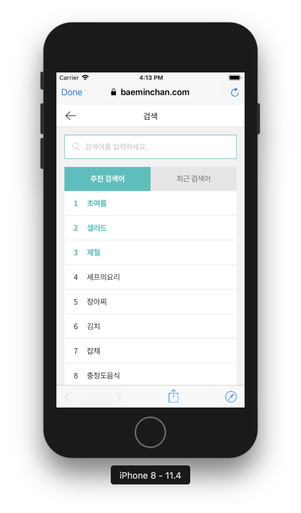

# swift-webviewapp

# 완성화면
### step1 : 2018.06.19
-  

### step2 : 2018.06.20
-  

### step3 : 2018.06.21
- 

### step4 : 2018.06.25
- 
- 콘솔출력
- ```
  (
        {
        valueTitle = "\Ud648";
        valueURL = "http://m.baeminchan.com/";
    },
        {
        valueTitle = "\Ubca0\Uc2a4\Ud2b8";
        valueURL = "http://m.baeminchan.com/best30/list.php";
    },
        {
        valueTitle = "\Uc54c\Ub730\Uc1fc\Ud551";
        valueURL = "http://m.baeminchan.com/promotion_c/list.php?cno=2160000";
    },
        {
        valueTitle = "\Uc2e0\Uc0c1";
        valueURL = "http://m.baeminchan.com/new/list.php";
    },
        {
        valueTitle = "\Ube0c\Ub79c\Ub4dc\Uad00";
        valueURL = "http://m.baeminchan.com/promotion/brand.php";
    }
  )
  ```

# 주요 구현/수정 사항
## Step1
- Safe Area이용하여 오토레이아웃 적용
- `webView.loadRequest(URLRequest(url: storeURL!))` URL로 웹페이지 로드


# 알게 된 것들 1.
> 미션 내용 관련 알게 된 것들

## UIWebView
  - 주의할 점
    - 서브클래싱 할 수 없다.
    - UIScrollView에 embed할 수 없다. 터치이벤트가 충돌날 수 있기 때문.
    - Deprecated 됨.
    - WKWebView로 대체

## UIWebViewDelegate
UIWebViewDelegate 메소드의 optional 메소드를 구현하여 웹의 콘텐츠가 로드되는 주기에 원하는 처리를 할 수 있다.

### UIWebViewDelegate메소드의 호출 순서
- 일반적인 호출 순서
```
webView(\_:shouldStartLoadWith:navigationType:)
// Sent before a web view begins loading a frame. 웹뷰의 프레임이 로드될 것이라고 호출
webViewDidStartLoad
// Sent after a web view starts loading a frame. 웹뷰가 프레임을 로드하기 시작하면 호출
webViewDidFinishLoad
// Sent after a web view finishes loading a frame. 웹뷰가 프레임 로드를 끝내면 호출
```
- 웹페이지 로드 후 다른 페이지로 이동했을때 전체 로그
```
webView(_:shouldStartLoadWith:navigationType:)
webViewDidStartLoad
2018-06-19 19:30:28.940806+0900 WebViewApp[46543:5664112] WF: === Starting WebFilter logging for process WebViewApp
2018-06-19 19:30:28.940990+0900 WebViewApp[46543:5664112] WF: _userSettingsForUser : (null)
2018-06-19 19:30:28.941219+0900 WebViewApp[46543:5664112] WF: _WebFilterIsActive returning: NO
webView(_:shouldStartLoadWith:navigationType:)
webViewDidStartLoad
webViewDidFinishLoad
webViewDidFinishLoad
webView(_:shouldStartLoadWith:navigationType:)
webViewDidStartLoad
webView(_:shouldStartLoadWith:navigationType:)
webView(_:shouldStartLoadWith:navigationType:)
2018-06-19 19:30:38.209504+0900 WebViewApp[46543:5664112] WF: _userSettingsForUser : (null)
2018-06-19 19:30:38.209824+0900 WebViewApp[46543:5664112] WF: _WebFilterIsActive returning: NO
webView(_:shouldStartLoadWith:navigationType:)
webViewDidStartLoad
webViewDidFinishLoad
webView(_:shouldStartLoadWith:navigationType:)
webViewDidStartLoad
webViewDidFinishLoad
webView(_:shouldStartLoadWith:navigationType:)
webViewDidStartLoad
2018-06-19 19:30:38.871265+0900 WebViewApp[46543:5664112] WF: _userSettingsForUser : (null)
2018-06-19 19:30:38.871678+0900 WebViewApp[46543:5664112] WF: _WebFilterIsActive returning: NO
webView(_:shouldStartLoadWith:navigationType:)
webViewDidStartLoad
webViewDidFinishLoad
webViewDidFinishLoad
webViewDidFinishLoad
```

- **의문점**
  - 왜 메소드들은 여러번 불리는걸까...?

## WKWebView

- 구현방법1 : 델리게이트 사용
```swift
import UIKit
import WebKit

class ViewController: UIViewController, WKUIDelegate {

    var webView: WKWebView!
    let storeURL = URL(string: "https://m.baeminchan.com")

    override func loadView() {
        let webConfiguration = WKWebViewConfiguration()
        webView = WKWebView(frame: .zero, configuration: webConfiguration)
        webView.uiDelegate = self
        view = webView
    }

    override func viewDidLoad() {
        super.viewDidLoad()
        let myRequest = URLRequest(url: storeURL!)
        webView.load(myRequest)
    }
}
```

- 구현방법2 : 스토리보드 사용
```swift
class ViewController: UIViewController {

    @IBOutlet weak var webView: WKWebView!
    let storeURL = URL(string: "https://m.baeminchan.com")

    override func viewDidLoad() {
        super.viewDidLoad()
        let myRequest = URLRequest(url: storeURL!)
        webView.load(myRequest)
    }
}
```

### WKWebView의 델리게이트
- WKUIDelegate : 자바스크립트 이벤트를 캐치하여 동작
- WKNavigationDelegate : 페이지의 start, loading, finish, error의 이벤트를 캐치할 수 있으며 웹페이지의 전반적인 상황을 확인할 수 있음

## WKWebViewConfiguration

- 웹뷰를 초기화할때 사용하는 프로퍼티들의 콜렉션
- 웹뷰가 처음 초기화될때만 사용할 수 있다. 웹뷰가 만들어지고(초기화되고)나서 이 클래스를 이용해서 웹뷰의 설정을 바꿀 수 없다.

- processPool: 웹뷰의 컨텐츠 프로세스를 가져올 프로세스 풀
  - 웹뷰가 초기화되면, 지정된 풀에서 새 웹 컨텐츠 프로세스가 만들어 지거나 해당 풀의 기존 프로세스가 사용됨.
- websiteDataStore: 웹뷰에서 사용되는 웹사이트 데이터스토어
  - 여기서 말하는 데이터란 쿠키, 캐시, WebSQL같은 영구적 데이터, IndexedDB 데이터베이스, 로컬 스토리지(사용자가 지우지 않는 이상 계속 브라우저에 남아있음- 자동 로그인)
  - 웹뷰가 비영구적인 데이터스토어와 연관되어있으면, 파일시스템에 아무 데이터도 써지지 않는다. 이 프로퍼티(websiteDataStore)는 웹뷰에서의 private한 탐색(브라우징)을 구현한다.

## WKNavigationAction
- navigationType(WKNavigationType())
- sourceFrame, targetFrame(WKFrameInfo())
- request(URLRequest): 네비게이션이 리퀘스트
- modifierFlags: The modifier keys that were in effect when the navigation was requested.


### 관련에러
> `configuration.userContentController = self.userContentController` 코드 한 줄에 따라 팝업을 unable하는 코드 인젝션이 성공하거나 실패했다.

- **Could not signal service com.apple.WebKit.WebContent: 113: Could not find specified service**
  - 처음에는 WKWebView()를 init할때 빈 init으로 객체를 만들어서 에러가 발생한다고 생각했는데,
  - 그게 아니라 객체가 하나만(한번만)만들어져서 load시키면 에러가 발생하지 않는다.
  - 그냥 빈 init으로라도 WKWebView객체가 하나만 만들어지면 문제가 발생하지 않았음(step2 코드 참고)
  - 문제는 configuration으로 추정!! configuration설명에서 `웹뷰가 처음 초기화될때만 사용할 수 있다. 웹뷰가 만들어지고(초기화되고)나서 이 클래스를 이용해서 웹뷰의 설정을 바꿀 수 없다.`는 내용이 있는데 이 때문인지도 모르겠다.

## WKUserContentController
자바스크립트가 웹뷰에 메시지를 전송하고 user script를 삽입할 수 있도록 하는 클래스


# 알게 된 것들 2.
> 미션 관련이 아니라 공부하다가 부수적으로 알게 된 것들!

## loadView()
> - 미션 초반 웹뷰를 loadView를 이용해서 루트뷰로 만들어줬었는데 프로그램 성격 상 loadView()가 필요하지 않다고 판단하여 사용하지 않음.
> - 대신에 loadView메소드가 어떨때 사용해야 하는지 정리.

- 컨트롤러가 관리하는 뷰를 만든다.
- 이 메소드를 직접 부르면 안됨
- 뷰 컨트롤러는 뷰컨트롤러의 view프로퍼티가 nil인데 요청됐을때 이 메소드를 호출하고, 이 메소드는 뷰를 로드하거나 만들어서 (loads or Creates) 뷰 프로퍼티에 할당한다.
- 뷰컨트롤러와 nib파일이 연결되어있으면, view를 nib파일로부터 호출한다.
- 뷰 컨트롤러가 연결된 nib파일이란 아래의 경우를 뜻한다.
  - nib파일의 nibName프로퍼티가 nil이 아닐때, init(nibName:bundle:)메소드를 활용해서 nib파일을 할당했을때, iOS가 앱 번들내에서 뷰컨트롤러의 클래스 이름의 nib파일을 발견했을때,
- 만약 뷰컨트롤러와 연결된 nib파일이 없으면, loadView()는 plain UIView객체를 만든다.
- 만약 인터페이스 빌더를 이용해서 뷰를 만들고 뷰컨트롤러를 초기화했다면 loadView()를 오버라이드 하면 안된다.
- 뷰를 수동으로 만들었을때 loadView를 오버라이드하며, 이때 만든 뷰를 rootView애 할당한다.
  - loadView에서 `view = UIView()`하면 현재만든 `UIView`객체를 루트뷰에 위치시키는 것
  - 만든 뷰는 하나의 유니크한 인스턴스여야하며 다른 뷰 컨트롤러 객체와 공유할 수 없다.
  - loadView()를 커스텀 구현할 super를 호출할 수 없다.
  - 해당 view에 추가적인 초기화가 필요하다면 viewDidLoad()에서 한다.
  - viewDidLoad()는 loadView()가 자신의 일을 다 마치고 UIView가 표시되기로(diaplayed) 준비됐을때 호출된다.

```swift
// 애플예시코드

class ViewController: UIViewController, WKUIDelegate {

    var webView: WKWebView!

    override func loadView() {
        let webConfiguration = WKWebViewConfiguration()
        webView = WKWebView(frame: .zero, configuration: webConfiguration)
        webView.uiDelegate = self
        view = webView // webView를 루트뷰에 할당
    }
    override func viewDidLoad() {
        super.viewDidLoad()

        let myURL = URL(string:ps://www.apple.com")
        let myRequest = URLRequest(url: myURL!)
        webView.load(myRequest)
    }}
```

- [참고링크 1](https://medium.com/yay-its-erica/viewdidload-vs-loadview-swift3-47f4ad195602
)
- [참고링크 2](https://www.clien.net/service/board/cm_app/1254193)
