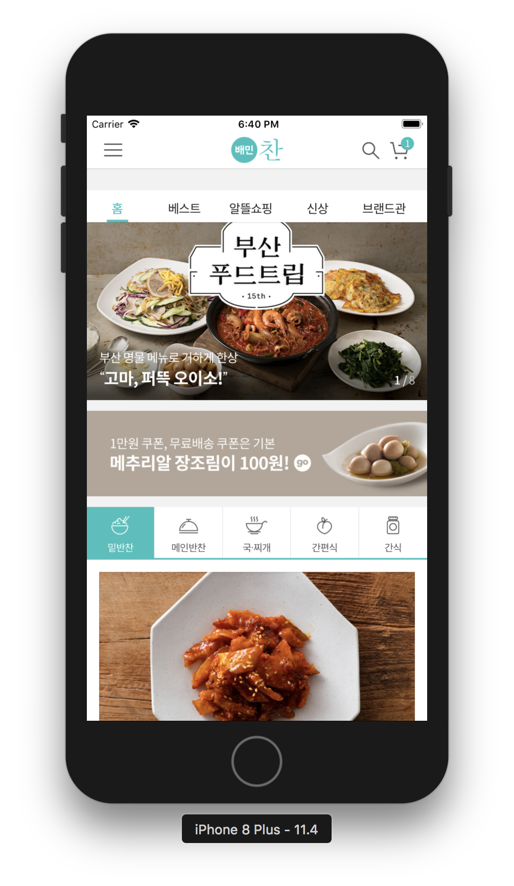
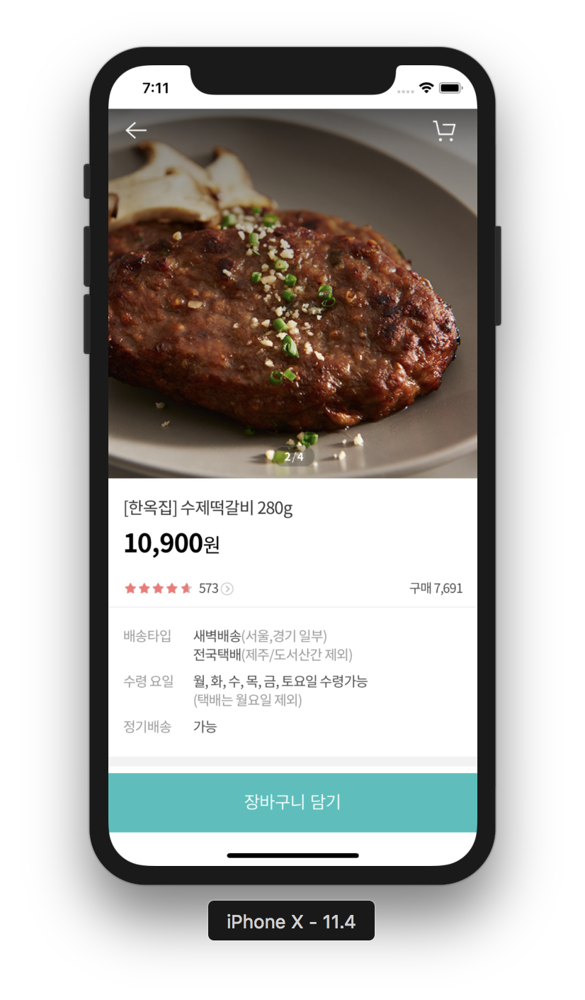
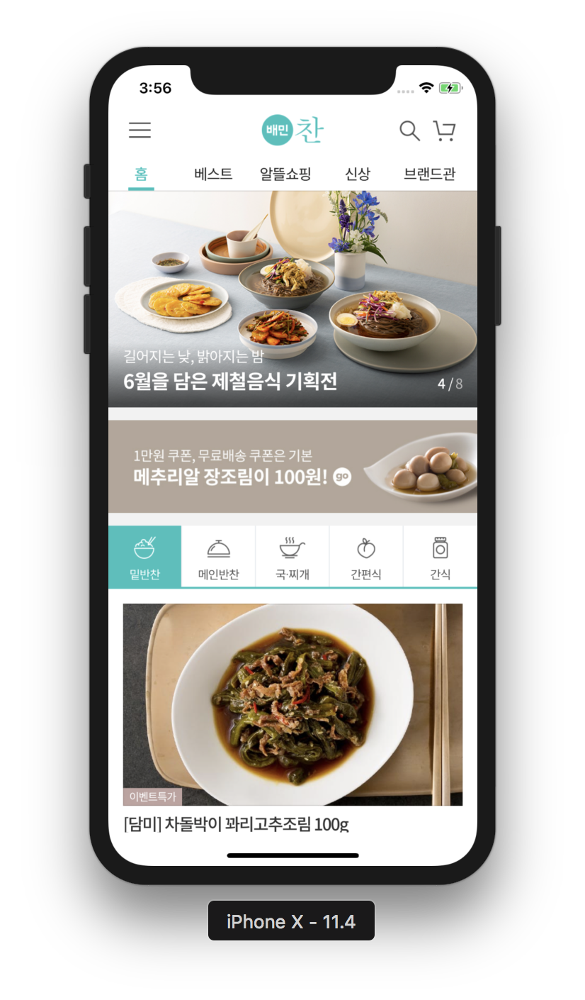
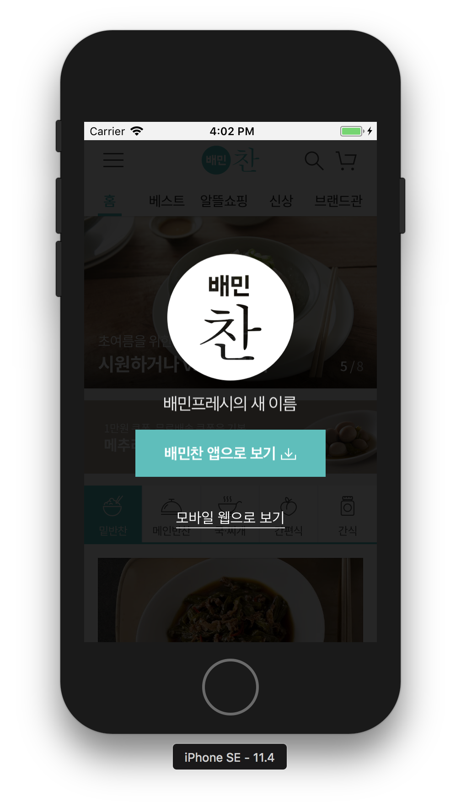
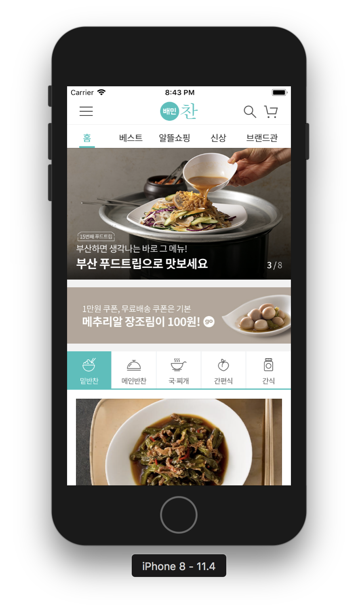

# swift-webviewapp

# 완성화면
### step1 : 2018.06.19
-  

### step2 : 2018.06.20
-  

### step3 : 2018.06.21
- 

# 주요 구현/수정 사항
## Step1
- Safe Area이용하여 오토레이아웃 적용
- `webView.loadRequest(URLRequest(url: storeURL!))` URL로 웹페이지 로드


# 알게 된 것들
## UIWebView
  - 주의할 점
    - 서브클래싱 할 수 없다.
    - UIScrollView에 embed할 수 없다. 터치이벤트가 충돌날 수 있기 때문.
    - Deprecated 됨.


## UIWebViewDelegate
UIWebViewDelegate 메소드의 optional 메소드를 구현하여 웹의 콘텐츠가 로드되는 주기에 원하는 처리를 할 수 있다.

### UIWebViewDelegate메소드의 호출 순서
- 일반적인 호출 순서
```
webView(\_:shouldStartLoadWith:navigationType:)
// Sent before a web view begins loading a frame. 웹뷰의 프레임이 로드될 것이라고 호출
webViewDidStartLoad
// Sent after a web view starts loading a frame. 웹뷰가 프레임을 로드하기 시작하면 호출
webViewDidFinishLoad
// Sent after a web view finishes loading a frame. 웹뷰가 프레임 로드를 끝내면 호출
```
- 웹페이지 로드 후 다른 페이지로 이동했을때 전체 로그
```
webView(_:shouldStartLoadWith:navigationType:)
webViewDidStartLoad
2018-06-19 19:30:28.940806+0900 WebViewApp[46543:5664112] WF: === Starting WebFilter logging for process WebViewApp
2018-06-19 19:30:28.940990+0900 WebViewApp[46543:5664112] WF: _userSettingsForUser : (null)
2018-06-19 19:30:28.941219+0900 WebViewApp[46543:5664112] WF: _WebFilterIsActive returning: NO
webView(_:shouldStartLoadWith:navigationType:)
webViewDidStartLoad
webViewDidFinishLoad
webViewDidFinishLoad
webView(_:shouldStartLoadWith:navigationType:)
webViewDidStartLoad
webView(_:shouldStartLoadWith:navigationType:)
webView(_:shouldStartLoadWith:navigationType:)
2018-06-19 19:30:38.209504+0900 WebViewApp[46543:5664112] WF: _userSettingsForUser : (null)
2018-06-19 19:30:38.209824+0900 WebViewApp[46543:5664112] WF: _WebFilterIsActive returning: NO
webView(_:shouldStartLoadWith:navigationType:)
webViewDidStartLoad
webViewDidFinishLoad
webView(_:shouldStartLoadWith:navigationType:)
webViewDidStartLoad
webViewDidFinishLoad
webView(_:shouldStartLoadWith:navigationType:)
webViewDidStartLoad
2018-06-19 19:30:38.871265+0900 WebViewApp[46543:5664112] WF: _userSettingsForUser : (null)
2018-06-19 19:30:38.871678+0900 WebViewApp[46543:5664112] WF: _WebFilterIsActive returning: NO
webView(_:shouldStartLoadWith:navigationType:)
webViewDidStartLoad
webViewDidFinishLoad
webViewDidFinishLoad
webViewDidFinishLoad
```

- **의문점**
  - 왜 메소드들은 여러번 불리는걸까...?

## WKWebView

- 구현방법1 : 델리게이트 사용
```swift
import UIKit
import WebKit

class ViewController: UIViewController, WKUIDelegate {

    var webView: WKWebView!
    let storeURL = URL(string: "https://m.baeminchan.com")

    override func loadView() {
        let webConfiguration = WKWebViewConfiguration()
        webView = WKWebView(frame: .zero, configuration: webConfiguration)
        webView.uiDelegate = self
        view = webView
    }

    override func viewDidLoad() {
        super.viewDidLoad()
        let myRequest = URLRequest(url: storeURL!)
        webView.load(myRequest)
    }
}
```

- 구현방법2 : 스토리보드 사용
```swift
class ViewController: UIViewController {

    @IBOutlet weak var webView: WKWebView!
    let storeURL = URL(string: "https://m.baeminchan.com")

    override func viewDidLoad() {
        super.viewDidLoad()
        let myRequest = URLRequest(url: storeURL!)
        webView.load(myRequest)
    }
}
```
